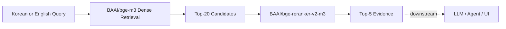

# Multilingual Financial Information Retriever for Foreign Residents in Korea

## Overview

이 프로젝트는 한국에서 금융서비스를 이용하는 외국인의 한국어·영어 질문을 공식 금융자료의 근거와 연결하는 다국어 정보 검색 시스템입니다. 정부·금융기관·공공기관의 PDF와 웹페이지를 공통 형식으로 정리하고, 검증된 문서 조각에서 질문과 관련된 근거를 찾도록 설계했습니다.

현재 이 repository에서 구현하고 평가한 범위는 **Retriever와 Top-5 evidence 산출까지**입니다. 검색된 근거를 이용한 LLM 답변 생성, Agent orchestration, UI와 배포는 별도의 downstream layer입니다.

## Problem

한국 금융생활을 처음 접하는 외국인은 다음과 같은 정보 접근 문제를 겪을 수 있습니다.

- 계좌, 카드, 송금, 금융사기 대응 정보가 여러 기관의 PDF와 웹페이지에 분산되어 있습니다.
- 필요서류, 금액, 기한, 조건과 예외가 금융용어와 함께 복잡하게 제시됩니다.
- 한국어 안내를 이해하기 어렵고, 단순 번역만으로는 현재 상황에서 무엇을 확인하고 행동해야 하는지 판단하기 어렵습니다.
- 금융사기 상황에서는 기관 사칭, 송금 요구, 개인정보 요구와 같은 위험 신호와 공식 대응 절차를 빠르게 찾아야 합니다.

이 프로젝트는 상품 추천이나 가입 판정, 실거래, 사기 확정 판단이 아니라 **공식자료에 근거한 금융정보 탐색**에 집중합니다.

## What We Built

- PDF와 Web 금융자료를 통합한 document/chunk corpus
- 한국어·영어 질문이 같은 evidence와 gold chunk를 공유하는 retrieval evaluation dataset
- BM25, multilingual Dense, Hybrid(RRF), Sparse, 번역 기반 Nori BM25와 여러 fusion 방식의 비교 실험
- 한국어와 영어에 공통으로 적용하는 BGE-M3 Dense→Reranker 최종 Retriever
- corpus, gold mapping, split 및 실험 결과의 재현성을 확인할 수 있는 Markdown/JSON artifact

## Dataset

### Corpus

| Item | Value |
|---|---:|
| Documents | 21 |
| PDF / Web | 8 / 13 |
| Document language | Korean 15 / English 6 |
| Final chunks | 563 |
| Chunk size / overlap | 400 / 60 tokens |
| Tokenizer | `BAAI/bge-m3` |

문서 단위로는 한국어 자료가 더 많지만 corpus는 한국어와 영어 자료를 모두 포함합니다. 따라서 순수 한국어 corpus로 표현하지 않습니다.

### Evaluation Dataset

| Item | Value |
|---|---:|
| Questions | 120 |
| Validation / Test | 80 / 40 |
| Validation–Test overlap | 0 |
| Korean / English questions | 120 / 120 |
| Evidence items | 167 |

네 카테고리는 각각 30문항입니다.

- `account_card`: 계좌·카드
- `remittance_exchange`: 해외송금·환전
- `notice_understanding`: 안내문 이해
- `fraud_safety`: 금융사기·안전

각 evaluation item의 한국어와 영어 질문은 같은 split, evidence와 gold chunk mapping을 공유합니다. 최종 400/60 corpus에서는 167개 evidence가 모두 gold chunk에 연결되었고, boundary-aware mapping 검증 후 unmatched/invalid corpus 오류는 0건입니다.

### Reliability Note

최종 corpus를 만들기 전 PDF 표 추출 누락과 gold boundary 문제를 점검하고, 의도한 문서 범위를 벗어난 PDF002 페이지를 제외했습니다. Historical 606-chunk baseline은 비교·재현 목적으로 별도 보존하며, 현재 source of truth는 563-chunk corpus입니다. 상세 과정은 [`retrieval_eval/retrieval_validation_final.md`](retrieval_eval/retrieval_validation_final.md)에 기록되어 있습니다.

## Retrieval Pipeline



- 한국어 질문은 BGE-M3에 직접 입력합니다.
- 영어 질문도 번역하지 않고 multilingual BGE-M3에 직접 입력합니다.
- corpus embedding과 query embedding의 dense similarity로 Top-20 후보를 생성합니다.
- 동일한 multilingual reranker로 후보를 재정렬해 Top-5 evidence를 반환합니다.

## Experiments

### Korean Retrieval

**가설:** 정확한 금융용어를 찾는 BM25와 의미 검색을 수행하는 Dense를 결합하면 Dense 단독보다 안정적인 후보를 만들 수 있는가?

**비교:** BM25, BGE-M3 Dense, BM25+Dense RRF Hybrid, Hybrid→Reranker를 평가한 뒤, 최종 Test40에서 Dense 후보와 Hybrid 후보를 동일한 reranker에 직접 연결해 비교했습니다.

**결과:** Hybrid는 final evidence Recall@5가 Dense보다 0.0167 높았지만 Hit@5는 0.8250으로 같았습니다. Dense는 candidate Recall/Hit/MRR과 final MRR/nDCG가 더 높았습니다. Query-level에서는 BM25가 Dense miss를 보완한 문항이 1개였지만 Hybrid가 Dense의 gold 후보를 잃은 문항도 2개였습니다.

**결정:** 작은 차이를 과대해석하지 않되, 후보 안정성·ranking quality·구조 단순성을 함께 고려해 **Dense Top-20→Reranker→Top-5**를 선택했습니다.

### English Retrieval

**가설 1 — direct cross-lingual Dense:** 영어 질문을 번역하지 않고 multilingual Dense로 현재 corpus를 직접 검색할 수 있는가?

English Test40에서 BGE-M3 Dense는 Hit@20 0.9500을 기록해 강한 baseline이 되었습니다.

**가설 2 — sparse/lexical signal:** BGE-M3 Sparse나 한국어 lexical retrieval이 Dense가 놓친 문항을 보완할 수 있는가?

Sparse는 일부 Dense miss를 찾았지만 평균 성능이 낮았고, Dense+Sparse RRF는 sparse-only signal을 보존하면서 Dense 성능도 유지하는 일관된 이점을 만들지 못했습니다. Paired-KO lexical diagnostic은 보완 가능성을 보여 실제 NLLB 번역→Elasticsearch Nori BM25 실험으로 이어졌습니다.

**가설 3 — translated Nori fusion:** Validation80에서는 Dense15+Nori5가 추가 coverage를 보여 고정된 구조로 Test40에서 검증했습니다. Test에서는 Dense hit 손실 없이 evidence Recall과 일부 ranking metric이 소폭 개선됐지만, 새로운 question-level candidate/final hit은 0건이었습니다.

**결정:** 번역 위험과 NLLB·Elasticsearch/Nori의 latency 및 운영 복잡도까지 고려해 translation/fusion을 main path에서 제외하고 **English query→BGE-M3 Dense Top-20→Reranker→Top-5**를 최종 구조로 선택했습니다. Sparse와 Nori 결과는 가치가 없다는 결론이 아니라, 현재 평가에서 main path의 추가 복잡도를 정당화할 만큼 일관된 held-out 이익이 없었다는 의미입니다.

## Final Architecture

한국어와 영어에 같은 Retriever를 사용합니다.

> **Korean / English Query → BAAI/bge-m3 Dense Top-20 → BAAI/bge-reranker-v2-m3 → Top-5 Evidence**

이 결정은 한국어에서 Dense와 Hybrid를 직접 비교하고, 영어에서 Dense·Sparse·번역/Nori·fusion을 단계적으로 검증한 결과입니다.

## Key Results

아래는 Final 563-chunk corpus의 Test40 결과입니다. Recall은 evidence-group coverage, Hit은 하나 이상의 gold evidence group을 찾은 question 비율입니다.

| Query | Pipeline | Recall@20 | Hit@20 | Recall@5 | Hit@5 | MRR@5 | nDCG@5 |
|---|---|---:|---:|---:|---:|---:|---:|
| Korean | Dense→Reranker | 0.9333 | 0.9500 | 0.7792 | 0.8250 | 0.6446 | 0.6376 |
| English | Dense→Reranker | 0.8958 | 0.9500 | 0.8000 | 0.8750 | 0.6863 | 0.6543 |

두 언어의 Test40 수치를 보고 영어가 한국어보다 일반적으로 우수하다고 해석하지 않습니다. 표본이 작고 question 표현 및 evidence 구성이 다르므로, 각 언어에서 최종 Retriever의 작동을 확인한 결과로 사용합니다.

## Evaluation Metrics

- `Recall@k`: 각 question에 필요한 evidence group이 Top-k에서 회수된 비율의 평균
- `Hit@k`: Top-k에서 하나 이상의 gold evidence group을 찾은 question 비율
- `MRR@k`: 첫 gold evidence의 reciprocal rank 평균
- `nDCG@k`: evidence-group-aware ranking quality

대체 gold chunk가 여러 개 있어도 같은 evidence group의 중복 relevance로 점수를 부풀리지 않도록 one-to-one evidence assignment를 사용합니다.

## Repository Structure

```text
.
├── retriever_dataset/
│   ├── documents/              # 21 normalized source documents
│   ├── chunks/                 # 300/50, Final 400/60, 500/80 chunks
│   └── metadata/               # corpus and chunk statistics
├── retrieval_eval/             # Korean retrieval code, results and validation
│   └── reference_baseline/     # historical 606-chunk comparison snapshot
├── retrieval_eval_en/          # English dense/sparse/Nori/fusion experiments
├── rag_evaluation_dataset.jsonl
├── test1.md                    # historical chunk-setting experiment report
└── 다국어_금융_AI_Agent_프로젝트_소개.md
```

주요 결과 문서:

- Korean data/retrieval validation: [`retrieval_eval/retrieval_validation_final.md`](retrieval_eval/retrieval_validation_final.md)
- Korean Dense vs Hybrid decision: [`retrieval_eval/dense_vs_hybrid_reranker_test.md`](retrieval_eval/dense_vs_hybrid_reranker_test.md)
- English final summary: [`retrieval_eval_en/english_retrieval_final_summary.md`](retrieval_eval_en/english_retrieval_final_summary.md)
- English experiment history: [`retrieval_eval_en/retrieval_en_progress.md`](retrieval_eval_en/retrieval_en_progress.md)

## Scope and Next Steps

현재 repository의 완료·검증 범위:

```text
Data → Chunking → Gold Validation
→ Korean/English Retrieval Evaluation
→ Dense Top-20 → Reranker → Top-5 Evidence
```

향후 별도 downstream layer:

```text
Top-5 Evidence → Grounded LLM Generation
→ Agent Orchestration → Citation/UI → Deployment
```

따라서 이 repository는 Agent 답변 생성이나 UI의 성능을 검증했다고 주장하지 않습니다. Downstream 구현에서는 Top-5 evidence를 근거로 사용하고, 숫자·조건·서류·기관명 및 citation이 원문과 일치하는지 별도 평가해야 합니다.

## Collaboration and Provenance

이 repository의 corpus와 retrieval pipeline은 KUBIG 팀 프로젝트의 데이터 수집, RAG 설계 및 평가 데이터 구축 작업을 기반으로 최종 검증·정리되었습니다. Historical baseline과 원본 작업 이력은 Git history 및 [`retrieval_eval/reference_baseline/`](retrieval_eval/reference_baseline/)에 보존되어 있습니다.
