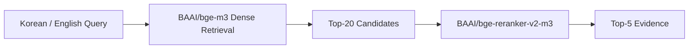
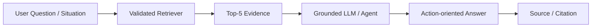

# 다국어 금융 상황 이해 AI Agent

## 1. 프로젝트 배경

한국에서 생활하는 외국인은 계좌 개설, 카드 사용, 해외송금, 환전, 금융사기 대응처럼 일상에 꼭 필요한 금융정보를 여러 기관에서 찾아야 합니다. 관련 정보는 정부·은행·금융감독기관·공공기관의 PDF와 웹페이지에 분산되어 있고, 안내문에는 금융용어뿐 아니라 조건, 예외, 필요서류, 금액과 기한이 복합적으로 포함됩니다.

한국어에 익숙하지 않은 사용자는 공식자료를 찾은 뒤에도 자신의 상황에 적용되는 내용을 판단하기 어렵습니다. 일반 번역은 문장의 언어를 바꾸는 데 도움을 주지만, 여러 자료의 근거를 연결해 “무엇을 확인하고, 지금 무엇을 해야 하는가”로 정리하는 것까지 보장하지 않습니다.

## 2. 문제 정의

프로젝트가 해결하려는 핵심 문제는 다음과 같습니다.

- **분산된 공식 금융정보:** 계좌·카드·송금·사기 대응 정보가 서로 다른 PDF와 웹페이지에 존재합니다.
- **언어 장벽:** 한국어 금융용어와 기관별 표현은 외국인이 필요한 근거를 직접 찾기 어렵게 만듭니다.
- **복잡한 적용 조건:** 같은 금융업무도 체류 상태, 거래 목적, 필요서류와 예외 조건에 따라 안내가 달라질 수 있습니다.
- **금융사기 위험:** 기관 사칭, 링크 클릭 유도, 송금 및 개인정보 요구 등의 위험 신호와 대응 절차를 빠르게 파악해야 합니다.
- **번역과 행동 사이의 간극:** 번역된 문장을 읽는 것과 자신의 상황에서 할 일·하지 말아야 할 일을 판단하는 것은 다른 문제입니다.

이 서비스는 금융상품 추천, 가입 가능 여부의 확정 판정, 실거래 수행 또는 사기 여부의 법적 확정을 목표로 하지 않습니다. 공식자료에 근거해 사용자가 정보를 이해하고 안전한 다음 행동을 판단하도록 돕는 것을 목표로 합니다.

## 3. 제안 서비스

최종적으로 지향하는 사용자 경험은 다음과 같습니다.

```text
한국어 또는 영어 금융 질문·상황 입력
→ 공식 금융자료에서 관련 근거 검색
→ 핵심 조건·서류·금액·기한·위험 신호 이해
→ 지금 할 일 / 하지 말아야 할 일 안내
→ 사용한 근거와 출처 제시
```

예를 들어 외국인이 “한국에서 계좌를 만들 때 어떤 서류가 필요한가요?” 또는 “보이스피싱 전화를 믿고 송금했다면 어떻게 해야 하나요?”라고 질문하면, 먼저 검증된 금융 corpus에서 관련 evidence를 찾고 이후 downstream Agent가 그 근거를 이해하기 쉬운 행동 중심 답변으로 구성하는 방식입니다.

현재 이 repository에서 실제 구현하고 검증한 범위는 이 흐름 중 **공식 근거를 Top-5 evidence로 검색하는 Retriever까지**입니다. 답변 생성, Agent orchestration, UI와 배포는 다음 단계의 서비스 layer입니다.

## 4. 데이터와 평가 기반

### 4.1 금융정보 Corpus

정부·금융기관·공공기관의 금융 안내자료를 공통 schema로 정리했습니다.

| 구성 | 규모 |
|---|---:|
| 전체 문서 | 21 |
| PDF | 8 |
| Web | 13 |
| 한국어 문서 | 15 |
| 영어 문서 | 6 |
| Final chunks | 563 |

최종 chunk는 `BAAI/bge-m3` tokenizer를 이용해 400 tokens, overlap 60 조건으로 생성했습니다. 문서 단위로는 한국어 자료가 더 많지만 영어 자료도 포함하므로 corpus를 순수 한국어 corpus로 표현하지 않습니다.

### 4.2 Retrieval Evaluation Dataset

공식자료에서 답을 확인할 수 있는 120개 질문을 구축했습니다.

| 구성 | 규모 |
|---|---:|
| Validation | 80 |
| Test | 40 |
| Split overlap | 0 |
| 한국어 질문 | 120 |
| 영어 질문 | 120 |
| 전체 evidence | 167 |

각 question ID에는 의미상 대응하는 한국어·영어 질문과 동일한 evidence/gold mapping이 연결되어 있습니다. 카테고리는 다음 네 가지이며 각각 30문항입니다.

- `account_card`: 계좌·카드
- `remittance_exchange`: 해외송금·환전
- `notice_understanding`: 안내문 이해
- `fraud_safety`: 금융사기·안전

난이도는 easy 36, medium 60, hard 24문항으로 구성됩니다. 평가에서는 candidate 단계의 Recall@20·Hit@20·MRR@20과 reranker 이후 Recall@5·Hit@5·MRR@5·nDCG@5를 사용했습니다.

### 4.3 신뢰성 검증

실험 전 PDF 표 추출 누락, gold evidence의 chunk 경계, 의도한 PDF 페이지 범위를 점검했습니다. 최종 400/60 corpus에서는 167개 evidence가 모두 gold chunk와 연결되며 PARTIAL, INVALID, CORPUS_ERROR, UNMATCHED는 모두 0건입니다.

이 검증은 프로젝트의 주 기능이 아니라, 이후 retrieval 비교가 실제 corpus와 일관된 gold를 기준으로 수행되도록 하기 위한 reliability 절차입니다.

## 5. Retriever 구축

최종 Retriever는 한국어와 영어 질문에 같은 구조를 적용합니다.



BGE-M3의 multilingual representation을 이용하므로 영어 질문도 번역 없이 직접 입력합니다. Dense retrieval로 의미상 관련된 Top-20 후보를 넓게 찾은 뒤, cross-encoder reranker가 질문과 각 chunk를 다시 비교해 최종 Top-5 evidence를 정렬합니다.

## 6. Retrieval Experiment Journey

실험은 가능한 기술을 단순 나열하는 대신, 다음 architecture 결정을 내리기 위한 질문 순서로 진행했습니다.

### 6.1 Korean Retrieval

**질문:** BM25의 정확한 어휘 매칭과 Dense의 의미 검색을 결합한 Hybrid가 Dense 단독보다 더 좋은가?

**비교:** BM25, BGE-M3 Dense, BM25+Dense RRF Hybrid와 reranker를 비교했습니다. 이후 동일한 Final Test40, Top-20 후보, 동일 reranker 조건에서 Dense→Reranker와 Hybrid→Reranker를 직접 평가했습니다.

| Korean Test40 | Recall@20 | Hit@20 | Recall@5 | Hit@5 | MRR@5 | nDCG@5 |
|---|---:|---:|---:|---:|---:|---:|
| Dense→Reranker | 0.9333 | 0.9500 | 0.7792 | 0.8250 | 0.6446 | 0.6376 |
| Hybrid→Reranker | 0.9125 | 0.9250 | 0.7958 | 0.8250 | 0.6342 | 0.6334 |

Hybrid의 evidence Recall@5는 0.0167 높았지만 question-level Hit@5는 동일했습니다. Dense는 candidate Recall·Hit·MRR과 final MRR·nDCG에서 더 높았습니다. BM25가 Dense를 보완한 문항은 1개였지만 Hybrid에서 Dense의 gold 후보가 사라진 문항도 2개였습니다.

**결정:** 차이가 매우 크다고 일반화하지 않으면서도, 후보 안정성·ranking quality·구조 단순성을 함께 고려해 Korean Dense→Reranker를 선택했습니다.

### 6.2 English Retrieval

#### 질문 1. 번역 없이 영어 질문으로 관련 근거를 찾을 수 있는가?

BGE-M3 Dense를 영어 질문에 직접 적용했습니다. Test40에서 Recall@20 0.8958, Hit@20 0.9500을 기록했고, reranker 이후 Recall@5 0.8000, Hit@5 0.8750으로 강한 direct cross-lingual baseline을 확보했습니다.

#### 질문 2. Sparse 또는 lexical signal이 Dense의 miss를 보완하는가?

BGE-M3 Sparse는 일부 Dense miss를 찾았지만 평균 성능이 낮았습니다. Dense+Sparse RRF에서는 sparse-only hit을 살리는 과정에서 다른 Dense candidate를 잃거나, Dense를 보존하면 추가 hit을 살리지 못했습니다. 따라서 Sparse를 main path에 포함할 근거가 충분하지 않았습니다.

Paired Korean question을 사용한 lexical diagnostic에서는 Dense가 놓친 사례를 찾을 수 있어 실제 번역 기반 retrieval의 가능성을 확인했습니다. 이 단계는 machine translation 성능이 아니라 translation error를 제거한 feasibility diagnostic으로 구분했습니다.

#### 질문 3. 실제 English→Korean translation과 Nori BM25는 held-out 성능을 높이는가?

Validation80에서 실제 NLLB 번역→Elasticsearch Nori BM25가 Dense miss 11개 중 7개를 candidate 단계에서 보완했습니다. 이를 바탕으로 Dense15+Nori5 구조를 고정한 뒤 Test40에서 평가했습니다.

| English Test40 | Recall@20 | Hit@20 | Recall@5 | Hit@5 | MRR@5 | nDCG@5 |
|---|---:|---:|---:|---:|---:|---:|
| Dense→Reranker | 0.8958 | 0.9500 | 0.8000 | 0.8750 | 0.6863 | 0.6543 |
| Dense15+Nori5→Reranker | 0.9125 | 0.9500 | 0.8000 | 0.8750 | 0.6988 | 0.6636 |

Fusion은 Dense hit을 잃지 않았고 evidence Recall과 일부 ranking metric을 소폭 높였습니다. 그러나 Dense miss를 새 question-level candidate 또는 final hit으로 전환한 사례는 0건이었습니다. Validation의 추가 question coverage가 Test에서 재현되지 않은 것입니다.

**결정:** Translation/Nori/Sparse가 본질적으로 가치가 없다고 판단한 것은 아닙니다. 다만 현재 held-out 결과에서 추가 question-level coverage가 확인되지 않았고, 번역 오류 가능성, NLLB 추론, Elasticsearch/Nori 운영과 latency를 더하는 비용을 고려해 English main path도 Dense→Reranker로 확정했습니다. Test 결과를 보고 추가 quota나 weight tuning은 하지 않았습니다.

## 7. 최종 Retriever Architecture

최종적으로 한국어와 영어에 동일한 architecture를 사용합니다.

> **Korean / English Query → BAAI/bge-m3 Dense Top-20 → BAAI/bge-reranker-v2-m3 → Top-5 Evidence**

이 구조는 다음 이유로 선택했습니다.

1. BGE-M3 Dense가 한국어와 영어 모두에서 높은 candidate Hit@20을 보였습니다.
2. Reranker가 Top-20 후보에서 질문과 직접 관련된 evidence를 Top-5로 재정렬합니다.
3. Korean Hybrid와 English Sparse/Nori fusion의 complementary signal은 관찰됐지만 held-out에서 일관된 question-level 순이익으로 이어지지 않았습니다.
4. 단일 multilingual retrieval path는 번역 모델과 별도 lexical infrastructure 없이 두 언어를 처리합니다.

## 8. Agent 확장 구조

Retriever 이후 서비스 architecture는 다음과 같이 확장할 수 있습니다.



Downstream Agent는 Top-5 evidence를 바탕으로 다음을 수행하는 방향입니다.

- 질문과 같은 언어로 핵심 금융정보 설명
- 필요서류, 금액, 기한, 조건과 예외 정리
- 금융사기 상황에서 확인할 위험 신호와 공식 대응 행동 제시
- 근거가 부족한 내용은 확정하지 않고 공식 기관 확인 안내
- 답변과 실제 source/chunk citation 연결

이 Agent/LLM/UI 구조는 **향후 서비스 architecture**이며, 현재 repository에서 생성 답변의 정확도나 UI 사용성을 검증 완료한 것으로 표현하지 않습니다.

## 9. 기대 효과

- 외국인이 여러 기관의 자료를 직접 탐색하는 시간과 부담을 줄일 수 있습니다.
- 한국어 또는 영어 질문을 별도 routing 없이 동일한 근거 검색 구조로 처리할 수 있습니다.
- 단순 번역을 넘어 질문과 관련된 공식 근거를 우선 제시할 수 있습니다.
- 계좌·카드·송금·환전과 같은 일상 금융업무의 조건과 필요서류를 확인하는 데 도움을 줄 수 있습니다.
- 금융사기 상황에서 위험 신호와 공식 대응자료에 더 빠르게 접근하도록 지원할 수 있습니다.

## 10. 현재 범위와 향후 과제

### 현재 완료·검증 범위

```text
금융자료 수집·정규화
→ 400/60 chunk corpus
→ Korean/English evaluation dataset
→ retrieval 실험 및 architecture selection
→ Dense Top-20 → Reranker → Top-5 Evidence
```

### 향후 별도 구현·검증 범위

- Top-5 evidence를 사용하는 grounded answer generation
- 숫자·서류·조건·기관명 및 citation 일치 검증
- 상황별 행동 안내를 조정하는 Agent orchestration
- 사용자 UI와 배포
- 실제 외국인 사용자를 대상으로 한 이해도·유용성 평가

## 11. 협업 및 기여

본 프로젝트는 KUBIG 팀의 금융자료 수집, RAG/서비스 설계, evaluation dataset 구축 및 retrieval 검증 작업을 기반으로 수행되었습니다. 세부 기술 provenance와 historical baseline은 Git history와 `retrieval_eval/reference_baseline/`에 보존되어 있으며, 현재 repository의 source of truth는 Final 563-chunk corpus와 Korean/English canonical evaluation artifact입니다.
